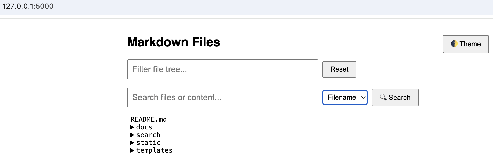
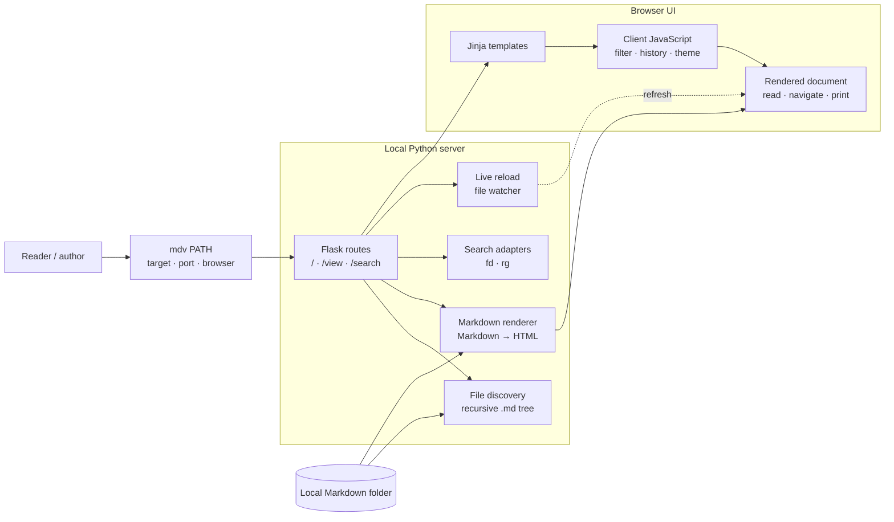
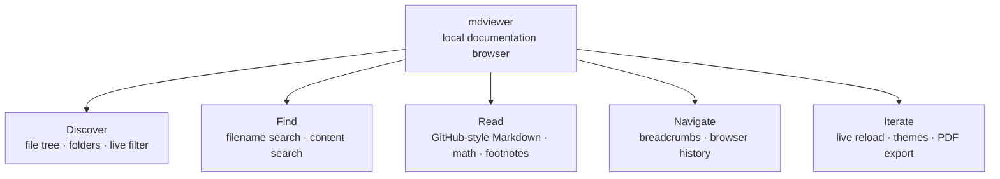

# 📝 Markdown Viewer (GitHub-Style)

[](https://pypi.org/project/mdviewer)
[](https://github.com/biaojiang/homebrew-mdviewer)
[](LICENSE)
[](https://pepy.tech/projects/mdviewer)

A GitHub-style Markdown viewer for local docs, with file tree, search, and live reload.

A local Markdown documentation browser that:

- Renders `.md` files with GitHub-flavored styles
- Displays a recursive file/folder tree
- Supports live plain-text filtering (client-side)
- Supports filename/content search using `fd` or `rg`
- Auto-reloads edited files
- Dark/light mode toggle
- Export/Print to PDF
- Breadcrumb navigation with folder/file icons
- Highlights current file in tree and auto-expands

## 🔍 Preview

`mdviewer` opens a clean, local browser UI to view Markdown files — with a collapsible file tree, file filtering, fuzzy search, and full-text content search built in.



## 🧭 Idea & Architecture

`mdviewer` turns a local folder of Markdown files into a browsable documentation
site with one command. The files remain the source of truth: the Python server
discovers and renders them, while the browser provides navigation, search, and
reading tools.





## 🚀 Installation

### 🔧 Option 1: Homebrew (macOS/Linux)

```bash
brew tap biaojiang/mdviewer
brew install biaojiang/mdviewer/mdviewer
```

### 🐍 Option 2: Python (via pip)

```
pip install mdviewer
```

**Optionally add an alias:**

```bash
echo 'alias mdv="mdviewer"' >> ~/.zshrc
source ~/.zshrc
# or symlink
sudo ln -s $(which mdviewer) /usr/local/bin/mdv
```

### 🔧 Option 3: Build from Source

```sh
# Install Python deps
pip install -r requirements.txt

# Optional: use a venv
python -m venv .venv
source .venv/bin/activate

# Install tools if needing advanced search
brew install fd ripgrep
# or
sudo apt install fd-find ripgrep

# ▶️ Run the Server
python app.py

Open [http://127.0.0.1:5000](http://127.0.0.1:5000/) in your browser.
```

---

## 🛠️ Usage
```bash
mdviewer [PATH] or mdv [PATH]

# e.g.:
mdv # serve the current directory and open the browser when Markdown is found
mdv .
mdv /path/to/README.md
mdv --no-open # serve without opening a browser
```

---

## 🚀 Features

- ✅ GitHub-style rendering via `markdown-it-py` + GitHub CSS
- ✅ Footnote references with links to definitions and return links
- ✅ Auto-expandable file tree using `<details>`
- ✅ Live filtering with reset button
- ✅ Backend-powered search:
	- `fd`: fuzzy filename matching
	- `rg`: content search
- ✅ Flask-based local webserver
- ✅ MathJax support for LaTeX
- ✅ Reload current buffer on changes (with `livereload`)
- ✅ Font Awesome icons for folders/files
- ✅ Breadcrumb that reflects navigation path
- ✅ Highlight + auto-expand tree for active file
- ✅ PDF/Print export button with clean print CSS

---

## 📁 File Structure

```text
.
├── docs
│   └── math
│       └── math-test.md
├── pyproject.toml
├── README.md
├── requirements.txt
├── screenshot.png
└── src
    ├── mdviewer
    │   ├── __init__.py
    │   ├── app.py
    │   ├── cli.py
    │   ├── search
    │   │   ├── __init__.py
    │   │   ├── __pycache__
    │   │   ├── fd_search.py
    │   │   └── rg_search.py
    │   ├── static
    │   │   ├── script.js
    │   │   └── style.css
    │   └── templates
    │       ├── index.html
    │       ├── search.html
    │       └── viewer.html
    └── 
```

---

## 🔍 Search Modes

- `fd`: fuzzy filename match (fast)
- `rg`: full-text content match (powerful)

---

## ⚙️ Keyboard & UI

- 🌓 Dark/light toggle
- ⌨️ Live tree filter with reset
- 🗂 Expandable nested folders
- 🔗 Click to render `.md` file in browser
- 🖨 Export/Print to PDF button
- 📁 Breadcrumb with Font Awesome icons
- 📄 Highlight + expand tree for active file

---

## ⏭️ Next Steps

-

---

## 📄 License

MIT
